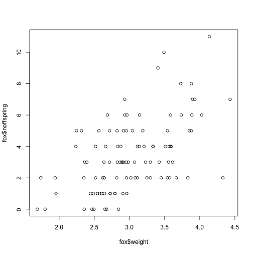
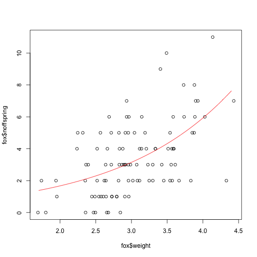
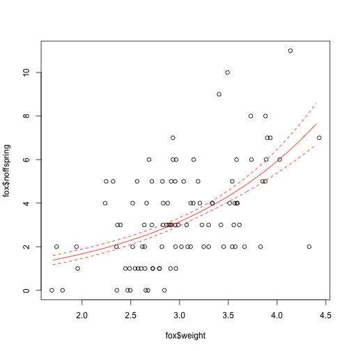
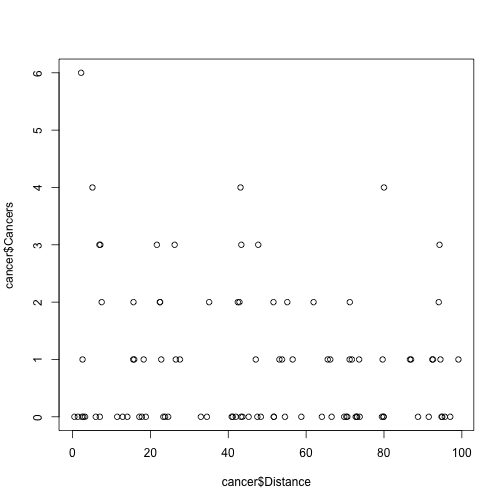
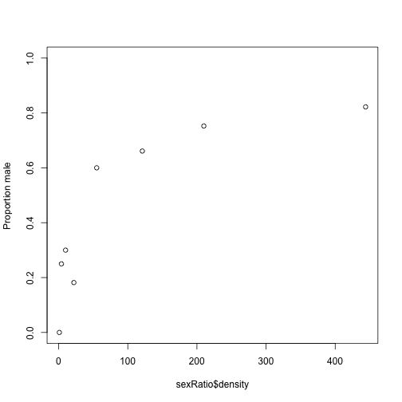
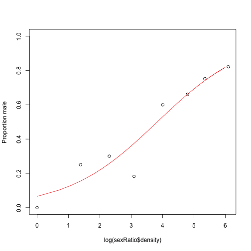

BB817 - Planning and evaluation of biological experiments
-------------------------
  
  
Generalised Linear Models (GLMs) (1)
========================================================
  
  *Owen R. Jones*  
  _jones@biology.sdu.dk_

------

### Background

The models dealt with so far in the course have all been linear models. The linear model includes ANCOVA, ANOVA, ordinary linear regression, multiple linear regression and others. The assumptions of these models are (1) the relationship between the explanatory variable(s) and the response variable are linear; (2) the errors are indpendent; (3) the variance is constant (it doesn't vary with the mean) (4) the error distribution is normal.

There are many situations where these assumptions would not hold. For example: where the response variable is a count, where the response variable is a proportion (e.g. number succeeding vs. number failing), or where it is simply a binary response (0/1), the errors cannot be truly normal because the values are bounded at 0 (you cannot get a count <0), or both 0 and 1 (you cannot have a proportion or binary response <0 or >1).

* Can you think of responses variables in experiments or field studies where an ordinary linear model would not work?

Generalised linear models (GLMs) relax three of these assumptions: (1), (3), and (4). 

There are 3 components: the linear predictor, the link function, and the error structure (also known as the variance function).

The main thing to get right when fitting GLMs is to choose an appropriate error structure and link function. The choice of error structure can be straightforwardly decided by thinking about the response variable: is it continuous or discrete? is it bounded?

For example, count data is bounded at 0, and is not continuous (you can't usually count half an animal).

In the next few pages we'll do some analyses using GLMs to deal with count data, binary (0/1) data, and ratio data. 

### Count data with Poisson errors.

The most common kind of count data where Poisson errors would be expected are frequencies of an event: we know how many times an event happened, but not how many times it did not happen (e.g. births, deaths, lightning strikes).

In these cases:

- Linear model could lead to negative counts.
- Variance of response likely to increase with mean (it usually does with count data).
- Errors are non-normal.
- Zeros difficult to deal with by transformation (e.g. log(0) = -Inf).
- Other error families do not allow zero values.

The standard link used with the Poisson error family is the log link. The log link ensures that all fitted (i.e. predicted) values are positive, while the Poisson errors take account of the fact that the data are integer and the variance scales 1:1 with the mean (i.e. variance increases linearly and is equal to the mean). There are other potential link and error families that *could* be used with this kind of data, but we'll stick with the standard ones here. Lets look at a couple of examples...


### Count data: Number of offspring in foxes.

This example uses the *fox.csv* data set. This data set gives the number of offspring produced by a group of foxes, alongside the weight (in kg) of the mothers. Let's import and plot the data (Figure 1).


```r
fox <- read.csv("fox.csv", header = TRUE)
plot(fox$weight, fox$noffspring)
```

 

The first thing to notice is that, like all count data, the data are formed into horizontal rows of data reflecting the fact that the response data are integer values. There is clearly an increasing pattern, but how can we formally test for a statistical relationship. It is obvious that fitting an ordinary linear model though this data would not be the right approach: this would lead to the prediction of negative number of offspring for small foxes, and also, the variance appears to increase with weight/number of offpspring. Therefore this is a good candidate for a GLM. The data are bounded at 0, and are integer values, and for this reason the usual approach would be to fit a GLM with Poisson errors (and the standard log link).


```r
mod1 <- glm(noffspring ~ weight, data = fox, family = poisson)
summary(mod1)
```

```
> 
> Call:
> glm(formula = noffspring ~ weight, family = poisson, data = fox)
> 
> Deviance Residuals: 
>    Min      1Q  Median      3Q     Max  
> -2.389  -0.972  -0.118   0.590   2.343  
> 
> Coefficients:
>             Estimate Std. Error z value Pr(>|z|)    
> (Intercept)   -0.750      0.311   -2.41    0.016 *  
> weight         0.632      0.095    6.66  2.8e-11 ***
> ---
> Signif. codes:  0 '***' 0.001 '**' 0.01 '*' 0.05 '.' 0.1 ' ' 1
> 
> (Dispersion parameter for poisson family taken to be 1)
> 
>     Null deviance: 166.85  on 99  degrees of freedom
> Residual deviance: 122.72  on 98  degrees of freedom
> AIC: 405.6
> 
> Number of Fisher Scoring iterations: 5
```


The model coefficients and their standard errors are given on the scale of the linear predictor. They tell us that there is a significant association between the weight of the fox mother and the number of offspring she will produce: larger foxes produce more offspring. Because the coefficients are given on the scale of the linear predictor rather than on the real scale it is useful to plot predictions of the model to visualise the relationship (Figure 2).

To do that we must (1) tell the model what to predict *from* i.e. we must provide a suitable sequence of numbers to predict from using **seq**, (2) use the **predict** function to predict values (*fit*) from the model. We use the argument *type = "response"* to tell the function that we want the preductions on the backtransformed (real) scale rather than on the scale of the linear predictor:


```r
plot(fox$weight, fox$noffspring)

newData <- data.frame(weight = seq(1.7, 4.4, 0.01))
newData$fit <- predict(mod1, newData, type = "response")

lines(newData$weight, newData$fit, col = "red")
```

 


We could add standard error lines to our model as follows. This is a bit fiddly, and requires extra steps, because of the way that the predict command produces the error values. Firstly we must specify that we want to get the standard errors of the fit using the *se.fit = TRUE* argument. Then we must use the **predict** function to produce the estimates. The object produced by this contains the *fit* and the standard errors of the fit (*se.fit*). To obtain the upper and lower bounds of the standard error we simply add/subtract the *se.fit* values to the *fit* values. We can then plot the three lines onto the graph (Figure 3).


```r
plot(fox$weight, fox$noffspring)

newData <- data.frame(weight = seq(1.7, 4.4, 0.01))
temp <- predict(mod1, newData, type = "response", se.fit = TRUE)

newData$fit <- temp$fit
newData$fit.upper <- temp$fit + temp$se.fit
newData$fit.lower <- temp$fit - temp$se.fit

lines(newData$weight, newData$fit, col = "red")
lines(newData$weight, newData$fit.upper, col = "red", lty = 2)
lines(newData$weight, newData$fit.lower, col = "red", lty = 2)
```

 


### Count data again: Cancer clusters


This data show counts of prostate cancer and distance from a nuclear processing plant. Lets take a look at the data.

Let's first import the data and use summary to examine it by plotting (Figure 4):
First we can see that there are no negative count values.


```r
cancer <- read.csv("cancer.csv", header = TRUE)
plot(cancer$Distance, cancer$Cancers)
```

 


Again, you will notice that the data are formed into horizontal rows of integer response values. There are lots of zero values at all distances, but the biggest cluster (6 cases), is very close to the plant. But is there a relationship between the distance from the nuclear plant and the number of cancers?

Let's fit a Generalised Linear Model to find out. As before will assume that the error is Poisson (that they variance increases directly in proportion to the mean), and we will use the standard log link to ensure that we don't predict negative values:


```r
mod1 = glm(Cancers ~ Distance, data = cancer, family = poisson)
summary(mod1)
```

```
> 
> Call:
> glm(formula = Cancers ~ Distance, family = poisson, data = cancer)
> 
> Deviance Residuals: 
>    Min      1Q  Median      3Q     Max  
> -1.550  -1.349  -1.155   0.388   3.130  
> 
> Coefficients:
>             Estimate Std. Error z value Pr(>|z|)  
> (Intercept)  0.18686    0.18873    0.99    0.322  
> Distance    -0.00614    0.00367   -1.67    0.094 .
> ---
> Signif. codes:  0 '***' 0.001 '**' 0.01 '*' 0.05 '.' 0.1 ' ' 1
> 
> (Dispersion parameter for poisson family taken to be 1)
> 
>     Null deviance: 149.48  on 93  degrees of freedom
> Residual deviance: 146.64  on 92  degrees of freedom
> AIC: 262.4
> 
> Number of Fisher Scoring iterations: 5
```


The coefficient of the output tells us that there is no significant increase in cancers with proximity to the plant. In fact there is a slight negative effect of distance. 

But remember, the Poisson error structure assumes that variance increases in direct proportion to the mean (this is what the statment *Dispersion parameter for poisson family taken to be 1* means.). In many cases, the variance increases faster than this: this is termed *overdispersion*. We can test for it by looking at the summary information andcomparing the residual deviance to the residual degrees of freedom, which should be equal. In this case, the residual deviance (146.64) is 1.594 times the residual degrees of freedom (92) [146.64/92 = 1.59]. The *rule-of-thumb*, is that we should consider the model *too* overdispersed if the ratio is greater than the square root of the dispersion parameter [i.e. sqrt(1.594) = 1.26]. Thus, in this case, the variance increases faster than the mean and perhaps Poisson is not the best error structure to use.

A better option is the Quasi-poisson family. With this family the variance is not constrained to increase *directly* in proportion to the mean. Let's see what the results are:


```r
mod1 = glm(Cancers ~ Distance, data = cancer, family = quasipoisson)
summary(mod1)
```

```
> 
> Call:
> glm(formula = Cancers ~ Distance, family = quasipoisson, data = cancer)
> 
> Deviance Residuals: 
>    Min      1Q  Median      3Q     Max  
> -1.550  -1.349  -1.155   0.388   3.130  
> 
> Coefficients:
>             Estimate Std. Error t value Pr(>|t|)
> (Intercept)  0.18686    0.23536    0.79     0.43
> Distance    -0.00614    0.00457   -1.34     0.18
> 
> (Dispersion parameter for quasipoisson family taken to be 1.555)
> 
>     Null deviance: 149.48  on 93  degrees of freedom
> Residual deviance: 146.64  on 92  degrees of freedom
> AIC: NA
> 
> Number of Fisher Scoring iterations: 5
```


This model has estimated the same coefficients, but the standard errors of the coefficients and the p-values are different. In this case, the dispersion parameter has been estimated by the model: it is 1.555. So, the model has taken this into account and again there is no hint of a significant effect of distance. 


### Logistic regression with binary (0/1) data: species incidence

Sometimes we are confronted with data where the response variable is simply a success or a failure, or a presence or absence. This kind of data is often best-analysed using a Generalised Linear Model with a binomial error structure (strictly speaking the errors are Bernoulli errors, but these are simply one kind of binomial error). Theis kind of analysis is often called *logistic regression*. Some examples dead/alive, occupied/empty, healthy/diseased etc.

Again: 
- Linear models could lead to unreasonable values (probabilities \>1 or \<0).
- Variance of response likely to be n-shaped (small near 0 and 1, large inbetween).
- Errors are non-normal.


* Can you think of any other examples of this kind of data?

Our example concerns the presence or absence on a set of islands of a particular species of bird. The response variable we are interested in is called "incidence" and a value of 1 means that the bird is present and breeding on the island, while a value of 0 means that the island has no breeding population there. The explanatory variable is the size of the island in km^2 and isolation (the distance of the island from the mainland in km).

Lets take a look at the data.


```r
island <- read.csv("isolation.csv", header = TRUE)
names(island)
```

```
> [1] "incidence" "area"      "isolation"
```


In this case there are two explanatory variables and we are therefore going to fit a *multiple regression* model with two variables using the GLM framework. 


```r
model1 <- glm(incidence ~ area + isolation, data = island, family = binomial)
summary(model1)
```

```
> 
> Call:
> glm(formula = incidence ~ area + isolation, family = binomial, 
>     data = island)
> 
> Deviance Residuals: 
>    Min      1Q  Median      3Q     Max  
> -1.819  -0.309   0.049   0.363   2.119  
> 
> Coefficients:
>             Estimate Std. Error z value Pr(>|z|)   
> (Intercept)    6.642      2.922    2.27    0.023 * 
> area           0.581      0.248    2.34    0.019 * 
> isolation     -1.372      0.477   -2.88    0.004 **
> ---
> Signif. codes:  0 '***' 0.001 '**' 0.01 '*' 0.05 '.' 0.1 ' ' 1
> 
> (Dispersion parameter for binomial family taken to be 1)
> 
>     Null deviance: 68.029  on 49  degrees of freedom
> Residual deviance: 28.402  on 47  degrees of freedom
> AIC: 34.4
> 
> Number of Fisher Scoring iterations: 6
```


Looking at coefficients and standard errors (which are on the logit scale) we can see that area has a significant positive effect on the probability of occupation (larger islands are more likely to be occupied) and isolation has a strong negative effect (isolated islands are much less likely to be occupied). To visualise this we can plot the model fits through a scatter plot of the data. It is best to do this separately for each variable so first we must make two separate models, one for each of the variables.


```r
modela <- glm(incidence ~ area, data = island, family = binomial)
modeli <- glm(incidence ~ isolation, data = island, family = binomial)
```


Then we can plot the two relationships in graphs side-by-side using the same approach as above (Figure 5). In these plots the fitted values (the modelled line) can be interpreted as a probability.


```r
par(mfrow = c(1, 2))
plot(island$area, island$incidence)
newData <- data.frame(area = seq(0, 9, 0.01))
newData$fit <- predict(modela, newData, type = "response")
lines(newData$area, newData$fit, col = "red")

plot(island$isolation, island$incidence)
newData <- data.frame(isolation = seq(0, 10, 0.01))
newData$fit <- predict(modeli, newData, type = "response")
lines(newData$isolation, newData$fit, col = "red")
```

 


### Binomial regression with proportion/ratio data

Another important class of binomial data is proportion or success/failure data. These data are characterised by the fact that we have information on how many times an event occurred *and* how many times it did *not* occur. These data include infection rates of diseases, sex ratios, percentage mortality etc. These data are bounded in a similar way to the data above, and are also best-analysed using binomial errors.

* Can you think of any other examples of this kind of data?

In the following example we will look at data from an experiment on sex ratios in an insect species. The experimenter wanted to know whether the population density at which the insect was held had a role in determining the sex ratio. Lets take a look at the data:


```r
sexRatio <- read.csv("sexratio.csv", header = TRUE)
sexRatio
```

```
>   density females males
> 1       1       1     0
> 2       4       3     1
> 3      10       7     3
> 4      22      18     4
> 5      55      22    33
> 6     121      41    80
> 7     210      52   158
> 8     444      79   365
```


You can see that the data are integer counts of males and females. In this case, the density is simply the sum of the females and males.

Let's plot the data as proportion males to see if we can see any pattern. First we can need to add a new column with that information:


```r
sexRatio$propMale <- sexRatio$males/(sexRatio$males + sexRatio$females)
```


Now we can plot the data (Figure 6). In this case I use the *ylim* argument to specify that the y-axis should go from 0 to 1 (since this is a proportion).


```r
plot(sexRatio$density, sexRatio$propMale, ylab = "Proportion male", ylim = c(0, 
    1))
```

 

It looks like there is a relationship, and it is definitely non-linear so we are justified in using a GLM for the regression.
This regression is different from the last *binomial* GLM because we are not dealing with a simple 0 or 1 response. Instead we have a number in two catefories (male and female). These are analysed by binding (using the **cbind** function) the two vectors of male and female counts into a single object that we will use as the response variable.


```r
y = cbind(sexRatio$males, sexRatio$females)
```


Lets have a look:


```r
y
```

```
>      [,1] [,2]
> [1,]    0    1
> [2,]    1    3
> [3,]    3    7
> [4,]    4   18
> [5,]   33   22
> [6,]   80   41
> [7,]  158   52
> [8,]  365   79
```

You can see that this is simply a matrix with two columns.

Now lets fit the model and take a look at the summary output:

```r
model <- glm(y ~ density, data = sexRatio, family = binomial)
summary(model)
```

```
> 
> Call:
> glm(formula = y ~ density, family = binomial, data = sexRatio)
> 
> Deviance Residuals: 
>    Min      1Q  Median      3Q     Max  
> -3.462  -1.276  -0.991   0.574   1.880  
> 
> Coefficients:
>             Estimate Std. Error z value Pr(>|z|)    
> (Intercept) 0.080737   0.155038    0.52      0.6    
> density     0.003510   0.000512    6.86  6.8e-12 ***
> ---
> Signif. codes:  0 '***' 0.001 '**' 0.01 '*' 0.05 '.' 0.1 ' ' 1
> 
> (Dispersion parameter for binomial family taken to be 1)
> 
>     Null deviance: 71.159  on 7  degrees of freedom
> Residual deviance: 22.091  on 6  degrees of freedom
> AIC: 54.62
> 
> Number of Fisher Scoring iterations: 4
```


We can now plot the data and the model's fitted values through it (Figure 7):


```r
plot(sexRatio$density, sexRatio$propMale, ylab = "Proportion male", ylim = c(0, 
    1))
newData <- data.frame(density = seq(0, 450, 1))
newData$fit <- predict(model, newData, type = "response")
lines(newData$density, newData$fit, col = "red")
```

 


Hmmm. This doesn't look so great (Figure 7). The model doesn't really capture the initial increase in male sex ratio. Let's see if we can improve it by logging the density variable before fitting.


```r
model2 <- glm(y ~ log(density), data = sexRatio, family = binomial)
summary(model2)
```

```
> 
> Call:
> glm(formula = y ~ log(density), family = binomial, data = sexRatio)
> 
> Deviance Residuals: 
>    Min      1Q  Median      3Q     Max  
> -1.970  -0.341   0.150   0.402   1.037  
> 
> Coefficients:
>              Estimate Std. Error z value Pr(>|z|)    
> (Intercept)   -2.6593     0.4876   -5.45  4.9e-08 ***
> log(density)   0.6941     0.0906    7.66  1.8e-14 ***
> ---
> Signif. codes:  0 '***' 0.001 '**' 0.01 '*' 0.05 '.' 0.1 ' ' 1
> 
> (Dispersion parameter for binomial family taken to be 1)
> 
>     Null deviance: 71.1593  on 7  degrees of freedom
> Residual deviance:  5.6739  on 6  degrees of freedom
> AIC: 38.2
> 
> Number of Fisher Scoring iterations: 4
```


There are two ways of easily comparing two GLM models that have the same response variable. Firstly you can look at the residual deviance. Resdual deviance is simply the amount of variation in the response variable that is NOT explained by the model: models with smaller residual deviance are better. You can also look at the AIC (Akaike Information Criterion). The AIC is a summary statistic that tries to capture how well the model fits the data while accounting for how complex the model is. It is too complicated to get into right now except to say that smaller AIC values are better.

By both of these methods, the second model (model2) is better than model 1. Lets plot it to confirm that visually (Figure 8).


```r
plot(log(sexRatio$density), sexRatio$propMale, ylab = "Proportion male", ylim = c(0, 
    1))
newData <- data.frame(density = seq(0, 400, 1))
newData$fit <- predict(model2, newData, type = "response")
lines(log(newData$density), newData$fit, col = "red")
```

 


Yes, that looks much better. That just goes to show that one should visually inspect the models and consider other ways of fitting the data: there are often ways of improving the fit.

In the next session we'll get some more practice of choosing modelling approaches and interpreting outputs...


