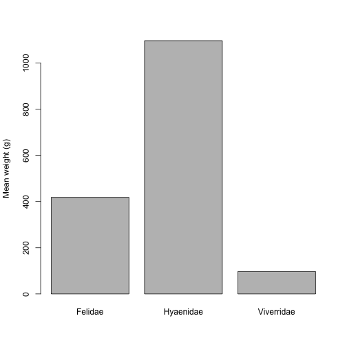

Answers to exercises in Handout 2
========================================================


**Remember:** make sure you have the carnivora data set loaded into your workspace (using *read.csv*) and named *carni*.

Q1. Randomly draw 25 numbers from a uniform distribution from 10 to 20.
-----------

```r
runif(25, 10, 20)
```

```
>  [1] 16.41 19.61 10.96 18.26 10.14 18.38 19.16 12.01 10.25 13.33 13.35
> [12] 14.22 17.68 15.47 18.05 18.79 13.00 15.81 15.28 18.07 11.26 17.26
> [23] 15.48 14.46 13.97
```


Q2. (a) Write a script to simulate flipping a coin. (b) Add **if** and **else** statements to print "Heads - you win!" or "Tails - you lose!" depending on the outcome.
-----------
(a) This part is pretty easy:

```r
coin <- c("Heads", "Tails")
sample(coin, 1)
```

```
> [1] "Heads"
```

(b) This part was a bit trickier:

```r
coin <- c("Heads", "Tails")
if (sample(coin, 1) == "Heads") {
    cat("Heads - you win!")
} else {
    cat("Tails - you lose!")
}
```

```
> Tails - you lose!
```


Q3. Make a scatter plot showing the relationship between log female weight (FW) and litter size (LS) in the *Canidae* and *Felidae* families. Use different colours for the points from each Family. 
------------------

This is just a case of plotting an empty plot, and using **points** to add in the points, first for the *Canidae* and then for *Felidae*. See Figure 1.

```r
plot(log(carni$FW), carni$LS, type = "n")
points(log(carni$FW[carni$Family == "Canidae"]), carni$LS[carni$Family == "Canidae"], 
    pch = 16, col = "blue")
points(log(carni$FW[carni$Family == "Felidae"]), carni$LS[carni$Family == "Felidae"], 
    pch = 16, col = "red")
legend("topleft", legend = c("Canidae", "Felidae"), pch = 16, col = c("blue", 
    "red"))
```

 


Q4.  Using the carnivore data set, make a **barplot** showing the mean birth weight (BW) for the Families in Superfamily *Feliformia*.
---------------

First we must subset the *carni* data frame, then use **droplevels** to get rid of unnecessary factor levels. Then we can use **tapply** to find the means. Since there are NA values we must use the *na.rm=TRUE* argument to remove them:


```r

Feli <- subset(carni, SuperFamily == "Feliformia")
Feli <- droplevels(Feli)
tapply(Feli$BW, Feli$Family, mean, na.rm = TRUE)
```

```
>    Felidae  Hyaenidae Viverridae 
>      418.1     1096.5       96.6
```


We can pass the results of this **tapply** function to barplot like this:


```r

temp <- tapply(Feli$BW, Feli$Family, mean, na.rm = TRUE)
barplot(temp, ylab = "Mean weight (g)")
```

 


